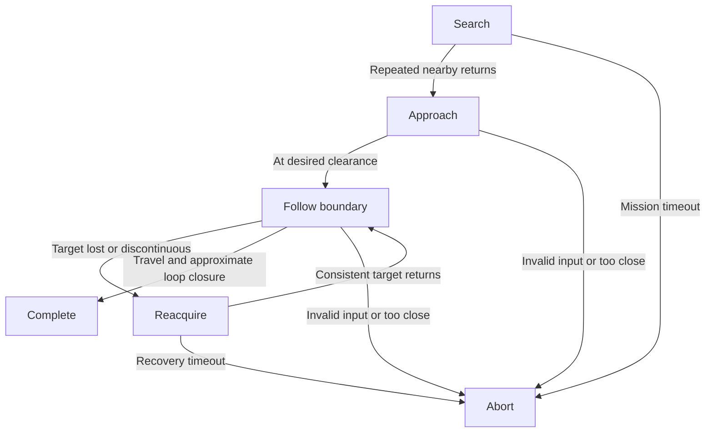

# Design: Autonomous Object Discovery and Orbit

**Status:** proposed flight architecture with an executable simulation concept.
**Project:** AMAZE / Crazyflie algorithms.
**Initial task:** autonomously find an object and make one pass around it.

## 1. Problem and scope

The drone starts without an object coordinate or a manually supplied route. It
must use observations to discover a candidate, approach it, maintain clearance
while traveling around it, and recognize approximate completion.

The first target is an isolated, stationary, convex object visible at the
horizontal sensor height. A circular cylinder and a box are useful initial
examples. A camera, object classifier, GPS or external positioning system is not
assumed. The operator starts the mission; continuous steering is not required.
Autonomy does not require all computation to run onboard: the planned Python
script can make decisions on the laptop and send commands over Crazyradio.

The initial interpretation of “orbit” is one loop around the object's outline
at roughly constant surface clearance. A true circle around an estimated center
is a separate design that requires center estimation and a radius decision.

## 2. Inputs, outputs and trust boundaries

| Layer | Receives | Produces |
| --- | --- | --- |
| Simulation world | Hidden obstacle geometry, drone pose | Synthetic range sweep |
| Controller | Range sweep, local pose, yaw, elapsed step | World-frame horizontal velocity, mission state |
| Proposed flight adapter | Measured ranges, pose logs, controller output | Body-frame `MotionCommander` velocity and flight supervision |

Only `DemoWorld` and the visualization know the object geometry. The controller
does not receive the simulator object, target coordinates, radius or shape. The
simulator separately uses ground truth to report clearance and detect collisions.
Ground-truth metrics are never fed back into the controller.

In this demo, local pose is ideal odometry and range acquisition is idealized.
Those assumptions are visible limitations, not claims about a physical deck.

## 3. Mission state machine



The input and time-limit checks apply in every active state even when a diagram
edge is omitted for readability. `COMPLETE` and `ABORT` are terminal and command
zero velocity in the simulation. Neither state currently issues a real landing.

### Search and candidate selection

Search selects the nearest valid return inside 1.8 m. Five successive scans
with a candidate are required before approaching. If no candidate is visible,
the demo moves slowly forward at 0.10 m/s. This is deliberately an open-area
search concept, not a complete room exploration policy. It has no mapped walls
or exploration memory, and it can miss objects outside its search corridor.

Candidate confirmation currently checks repeated proximity, not a matched
object track. A wall, unrelated obstacle or new nearby object can still fool it.
Multi-object association and room-wall rejection belong to later work.

### Approach

Approach drives toward the detected surface until the range is within 0.06 m of
the 0.55 m target. Approach speed is limited to 0.15 m/s. The controller records
the local entry position when it begins following.

### Follow boundary

At each update, use the nearest sweep return to estimate a direction toward the
surface. In the single-obstacle demo this approximates the surface normal. It
is not a general normal estimator for sparse hardware measurements.

Let `n = (nx, ny)` be a unit vector toward the observed surface in world
coordinates. Counterclockwise travel with the surface on the left uses:

```python
tangent = (ny, -nx)
error = measured_distance - desired_clearance
velocity = forward_speed * tangent + correction_gain * error * normal
```

Positive error adds motion toward the surface; negative error pushes outward.
The vector magnitude is capped at 0.25 m/s. The prototype's nominal boundary
speed is 0.20 m/s and correction gain is 0.8 per second.

This is feedback control: each command is recalculated from the newest
observation. The controller does not play back a list of hidden object waypoints.

### Reacquire

If no candidate returns, or the nearest surface direction jumps more than 65
degrees or distance jumps more than 0.45 m, command zero velocity and continue
scanning. Resume if a surface consistent with the previous observation returns.
Abort after more than three seconds without reacquisition.

This continuity heuristic reduces some accidental target switches. It cannot
establish object identity. Because the demo provides complete scans, it does
not yet model how the physical drone turns to reacquire a target or rounds a
corner with only four horizontal range readings.

### Completion

Declare an approximate completed lap only when all of the following hold:

- The drone has left a 0.45 m neighborhood of its following entry position.
- It has accumulated more than 2.0 m of travel while following.
- The observed world-frame surface bearing has accumulated more than 330
  degrees of net counterclockwise change, using wrapped angular differences.
- It is again within 0.16 m of the entry position.

Using surface bearing rather than commanded yaw avoids treating an in-place
turn as an orbit. The tests explicitly check that a stationary drone does not
complete a lap. This remains a heuristic: odometry drift, moving targets,
changing obstacles and repeated paths can produce false positives or negatives.
It intentionally allows near-closure rather than guaranteeing an exact 360-degree
trajectory around a verified target.

## 4. Coordinate and unit conventions

| Quantity | Convention |
| --- | --- |
| Position and distance | Meters |
| Velocity | Meters per second |
| Internal bearings and yaw | Radians; counterclockwise positive |
| World axes | Arbitrary local x/y frame |
| Body axes | Positive x forward, positive y left |
| Controller output | World-frame horizontal velocity |

The intended hardware adapter converts velocity with `v_body = R(-yaw) @ v_world`.
The documented `MotionCommander.start_linear_motion` API uses meters/second and
degrees/second for yaw rate. Angle units and turn signs must be verified against
the team's installed `cflib` and firmware before connecting this controller.
Do not infer the command yaw sign solely from the simulator's mathematical axes.

The demonstration uses `yaw = 0` throughout: a synthetic sweep covers every
bearing without physically rotating the simulated drone. It therefore does not
demonstrate inward-facing flight or scan-yaw control.

## 5. Simulation assumptions

| Simplification | Consequence |
| --- | --- |
| Full instantaneous sweep every 0.1 s, 72 exact rays | Much more observation coverage than a Multi-ranger supplies at once |
| No field-of-view ambiguity, latency, noise or missing packets | Surface direction is easier to estimate than on hardware |
| Perfect local pose and heading | Loop closure does not experience Flow-deck drift |
| Immediate velocity tracking | No acceleration, braking distance or aerodynamic effects |
| A single isolated object; no room walls | Target identity and clutter interactions are not demonstrated |
| Planar movement | Altitude, ground texture and overhanging objects are not modeled |
| Assumed 0.09 m footprint | Collision metric must be revisited for the actual platform |

The simulator provides a presentation and logic-development environment. It
does not validate flight performance, coverage guarantees or collision freedom.

## 6. Relationship to the supplied navigation script

The existing script has `ReactiveController`, a simulated ranger and a `fly()`
adapter using `Multiranger`, `MotionCommander` and local Kalman state logs. Its
escape behavior already combines a tangent with a surface-distance correction.
This design applies that idea to staying around an object rather than leaving
the boundary to seek a fixed goal.

Retain the existing navigation script as a reference. Add this feature beside
it; do not replace its behavior until the new controller is reviewed. The
provided real-flight section is labeled untested, continues after some deck
verification failures, and lacks timestamp-based freshness checks for pose.
Those issues must be addressed in a future adapter rather than copied silently.

## 7. Hardware integration plan

1. Confirm deck detection, installed library/firmware versions, logging fields
   and Crazyradio access in the team's existing environment.
2. Record timestamped ranges and pose while stationary and during controlled
   rotations. Establish sensor frames, range validity and measurement offsets.
3. Decide between a real scan-building adapter and direct sparse-sensor wall
   following. The latter likely needs explicit alignment and corner states;
   feeding four raw ranges into this full-sweep demo is not a valid conversion.
4. Implement freshness limits, measured control-loop timing, speed limits,
   connection-loss behavior, altitude supervision and landing behavior.
5. Evaluate the controller with realistic sensing and motion dynamics before
   supervised low-speed flight experiments.

USB/radio access through Windows Docker is an integration question, not assumed
to work from `docker run hello-world`. Reuse the repository's actual setup
instructions once available. No Docker changes are included in this module.

## 8. Milestones and definition of done

| Milestone | Deliverable | Current status |
| --- | --- | --- |
| M0: Presentable concept | Docs, state machine, two demo paths, focused tests | Included |
| M1: Realistic observation model | Four beams, finite field of view, noise, scan timing and drift | Planned |
| M2: Reliable isolated-object loop | Repeatable discovery, target tracking, recovery and closure | Planned |
| M3: Flight adapter | Verified Crazyflie sensing and command interface | Planned |
| M4: Team demonstration | Supervised flight with logs and measured acceptance criteria | Planned |

The current branch is complete as a concept package when the examples run,
the tests pass and its limitations are understandable. It should not be
described as a completed hardware autonomy feature.

## 9. Decisions still open

- Does the final task require any isolated object or a specific object class?
- Is following the outline acceptable, or must the path be circular?
- Must the nose or a camera remain directed toward the object?
- What object dimensions, clearance, search area and flight height are expected?
- How will the mission distinguish an object from the room's perimeter?

## 10. Primary references

1. [Multi-ranger deck](https://www.bitcraze.io/multi-ranger-deck/): range-only
   observations in front/back/left/right/up; avoidance is not automatic.
2. [Flow deck v2](https://www.bitcraze.io/flow-deck-v2/): optical motion and
   ground-distance sensing.
3. [MotionCommander API](https://www.bitcraze.io/documentation/repository/crazyflie-lib-python/master/api/cflib/positioning/motion_commander/): velocity-based
   motion primitives and accumulated position error.
4. [Webots wall following](https://www.bitcraze.io/documentation/repository/crazyflie-simulation/main/user_guides/webots_wall_following/): relevant official
   example for a future sparse-sensor implementation.
5. [STEM ranging tutorial](https://www.bitcraze.io/documentation/tutorials/getting-started-with-stem-ranging-bundle/): Python sensor/motion integration.

Consulted September 28, 2026. Prototype control rules and thresholds above are
project design choices, not manufacturer recommendations.
