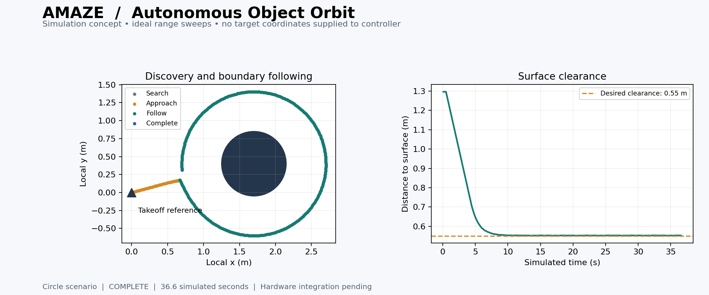

# Autonomous Object Orbit

**AMAZE algorithms • Concept prototype • Simulation only**

Discover a nearby stationary object and travel around its boundary without
human steering or a supplied target location. This starter establishes a
reviewable mission design and a small executable demonstration for the
Crazyflie + Flow deck v2 + Multi-ranger setup described in the team's navigation
script.



## What works in this branch

- A standalone Python controller chooses motion from synthetic range sweeps
  and local pose estimates. It never receives the object's center, radius or shape.
- A small 2D simulator demonstrates search, approach, boundary following and
  approximate lap completion around an isolated circle or box.
- An empty scene ends at the mission timeout. Invalid readings, a very close
  surface and prolonged target loss end the attempt with zero commanded velocity.
- Eight focused automated tests cover these behaviors and false lap detection.

**The main simplification:** the demo supplies an instantaneous 360-degree range
sweep with 5-degree spacing every 0.1 seconds. A physical Multi-ranger has four
horizontal directions, not a 360-degree scanner. Building usable sweeps from
rotation and timestamped readings is a separate, unfinished integration task.
There is no `cflib` import, radio connection, takeoff or motor command in this demo.

## Run the demo

From the repository root, using Python 3.10 or newer:

```bash
python algorithms/object_orbit/prototype.py
python algorithms/object_orbit/prototype.py --scenario box
python algorithms/object_orbit/prototype.py --scenario empty
```

The numerical demo and tests use only the Python standard library. They work
without Docker, a Crazyradio or a connected drone.

```bash
python -m unittest discover -s algorithms/object_orbit -p "test_*.py" -v
```

Optional chart generation requires Matplotlib:

```bash
python -m pip install -r algorithms/object_orbit/requirements-demo.txt
python algorithms/object_orbit/prototype.py --plot algorithms/object_orbit/assets/orbit_demo.png
python algorithms/object_orbit/prototype.py --scenario box --plot algorithms/object_orbit/assets/box_demo.png
```

Use `--csv path/to/trace.csv` to export the simulated trace. Generated CSV traces
are ignored by the module's `.gitignore`; the two presentation images are tracked.
The CLI exits normally even for a mission `ABORT`; inspect the printed final state.

## Mission in one minute

1. **Search:** scan and slowly explore the clear demonstration area.
2. **Approach:** confirm a nearby surface and move toward the desired clearance.
3. **Follow:** combine motion along that surface with distance correction.
4. **Reacquire:** hold position if the target disappears or changes abruptly.
5. **Complete:** require travel away from, and back toward, the entry position
   plus a substantial net change in the observed surface direction.

An object is represented by geometry, not recognized by name or appearance.
This prototype assumes a single isolated obstacle in otherwise open space.
It does not establish that the nearest surface is the intended mission target.

## Demonstrated results

| Scenario | Result | Simulated time | Minimum center-to-surface clearance |
| --- | --- | ---: | ---: |
| Isolated circular object | COMPLETE | 36.6 s | 0.551 m |
| Isolated square object | COMPLETE | 39.8 s | 0.541 m |
| Empty area | ABORT at timeout | 120.1 s | Not applicable |

These are deterministic results from the included idealized simulator, not
flight measurements. The one-tick timeout overrun follows discrete 0.1 s updates
and floating-point accumulation. Desired clearance is 0.55 m; the simulator uses
an assumed 0.09 m drone footprint. Actual dimensions and sensor offsets need
measuring before hardware work.

## What is still planned

| Area | Current status |
| --- | --- |
| Physical Multi-ranger acquisition and scan timing | Planned |
| World/body command conversion and yaw behavior | Planned for flight adapter |
| Reliable target identity and distinction from room walls | Not implemented |
| Position drift, sensor noise and vehicle acceleration | Not modeled |
| Flight supervision, landing and connection-loss handling | Not implemented |
| Geometrically circular orbit around an estimated center | Future option |

This is **boundary following**. A box produces a rounded boundary-following path,
not a perfect circle. That fits an initial “go around an object” demonstration.

## Files and reading order

| File | Purpose |
| --- | --- |
| [DESIGN.md](DESIGN.md) | Mission architecture, equations, assumptions and integration plan |
| [DEMO.md](DEMO.md) | A short team presentation and demo walkthrough |
| [TEST_PLAN.md](TEST_PLAN.md) | Executed checks, remaining experiments and hardware gates |
| [prototype.py](prototype.py) | Controller, range-only simulator interface and optional plotting |
| [test_prototype.py](test_prototype.py) | Focused automated checks |
| [PR_DESCRIPTION.md](PR_DESCRIPTION.md) | Ready-to-use draft pull request description |

## Relationship to the existing repo

The supplied navigation script already separates a controller from simulated
and real inputs. This module follows that pattern without changing that script.
Its eventual adapter can reuse the team's range logging, local pose estimates
and `MotionCommander` integration after those pieces are verified.

Use the Docker setup already present on `main` once its README and service names
have been checked. This module intentionally does not invent Compose commands,
radio passthrough settings or a replacement Dockerfile.

## References

- [Bitcraze: Multi-ranger deck](https://www.bitcraze.io/multi-ranger-deck/)
- [Bitcraze: Flow deck v2](https://www.bitcraze.io/flow-deck-v2/)
- [Bitcraze: MotionCommander API](https://www.bitcraze.io/documentation/repository/crazyflie-lib-python/master/api/cflib/positioning/motion_commander/)
- [Bitcraze: Webots wall-following example](https://www.bitcraze.io/documentation/repository/crazyflie-simulation/main/user_guides/webots_wall_following/)

Reference documentation consulted September 28, 2026. Hardware APIs must be
checked against the versions pinned by the team.
